```{r setup, include=FALSE}
knitr::opts_chunk$set(echo = FALSE)
```

# Original Data Visualization

The original data visualization looks like the graph presented below:
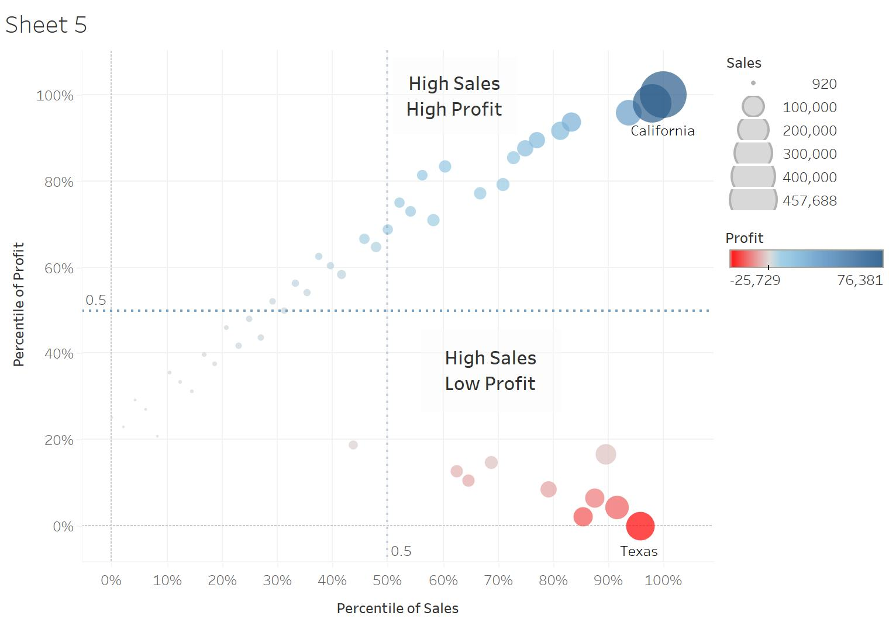
The graph presented the merchandise imports and exports of 6 different countries between 2019 to 2020. Six countries included should be the top six trading countries that have the greatest trading values. 


# Part A: Critique of Visualisation

### Clarity

1. **Uninformed Title:** The title of the original graph “Merchandise Trade of Top Six Trading Countries, 2019-2020” does not indicate what the visualization is intended to do. It is quite vague to say what message this graph trying to emphasize. Does it highlight the differences between imports and exports value within 6 countries or does it compare merchandise trading trends of these countries? An unclear title makes it difficult for the audience to catch the key message quickly. 

2. **Inconsistency of period presented:** The x-axis label for Japan is different from the others (2020 only). The graph of Japan contains less information than the others. The difference between the trading history of Japan and that of other countries is unclear because of this limitation.

3. **Inconsistency of y-axes units:** y axes of the graphs of 6 countries have inconsistent labels. For instance, each unit of the Export axis of Hong Kong represents 2M, but each unit of the same axis on the graph of Japan and Taiwan represents 1M only. The same issue can also be found for the Import axes of these graphs. The inconsistency of y-axes would make it difficult to compare the trading history of different countries.

4. **Dual axis is out of sync:** y axes of export and import share different units for the same country. This makes it hard for the audience to compare the imports and exports value of a specific country.

5. **Unnecessary use of Area Chart:** Area chart should be considered only if the total of the value presented is as important as its shares or if there is a large difference between the value presented. However, the original graph does not have any of these purposes. On the other hand, a line graph can display the trading patterns of each country better and a bar chart would be a better choice to be used to emphasize the difference between each country’s imports and exports value. 

6. **No Annotation:** Annotation that helps to tell the data story is not used in the original graph.


### Aesthetic

1. **Invisible Tick Mark:** Tick marks are necessary on a continuous scale. They help to mark the major divisions and show the exact point on the axis. The colour of tick marks on the original is too light and makes them invisible and unhelpful. 

2. **Poor color choice:** Imports and Exports are displayed using two different colours in the original graph. However, both colours are too light hence they do not contrast sufficiently with each other. Using brighter colors will improve the aesthetics of the visualization. 

3. **Separated graphs:** Merchandise trades of these countries are presented in 6 separate graphs. 6 graphs are too much to be showed on one dashboard; this makes the whole visualization ununited and scattered. To improve the aesthetics, data should be presented with a smaller number of separated graphs.

4. **Legend:** A legend is used to indicate different trading types. It could be quite troublesome for audiences to check the legend when they read the graph. A legend should be replaced by a direct label if possible.


# Part B: Alternative Design

The proposed alternative visualization design is displayed below:

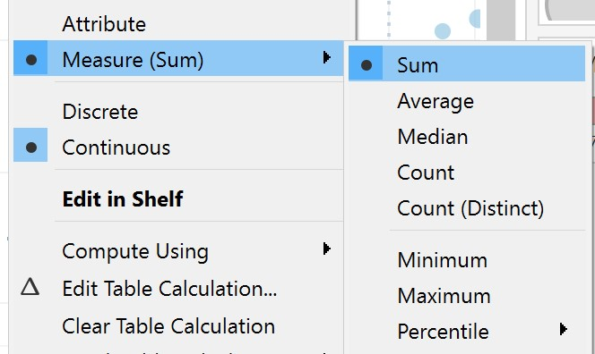

## Advantages of the new design: 

### Clarity

1. **Clear titles** are provided to indicate the purpose of the graphs and help audiences to catch the key information quickly.
2. **Consistency of the units and labels** for the x-axis and y-axis. This would make avoid the misleading display of the data provided.
3. Display trading data in a quarter unit would **display smaller changes** that cannot be found in the original graph.
4. **Better graph formats** are adopted to deliver the data in a better and clearer way. 
5. **Annotation** will be added to help to tell the data story.

### Aesthetic

1. **Tick marks** can be seen by the audiences and help them to identify the divisions on the axis.
2. **Legends can be replaced by direct labels**. This makes it easier for the audience to read and also enhance the tidiness of the visualization
3. **Fewer graphs** are presented on one dashboard. Information is united and the display of the dashboard would be more organized.
4. **Contrasting colors** are used to help to deliver the information and improve the aesthetic design of the visualization. 


# Part C: Proposed Visualisation

Please view the interactive visualization on Tableau Public [**here**](https://public.tableau.com/app/profile/manye.liu/viz/DataVisualization_16223090271340/Finallook)


# Part D: Step-by-step Guide
After downloading data from the Department of Statistics, Singapore (DOS), we can prepare the proposed alternative data visualization step-by-step.

## Data Preparation
Reorganizing the data by using Excel for further use. All the steps displayed below should be operated in both T1 and T2 sheets that contain Imports and Exports trading data separately.

* **Step 1: Delete unnecessary rows**
<center>
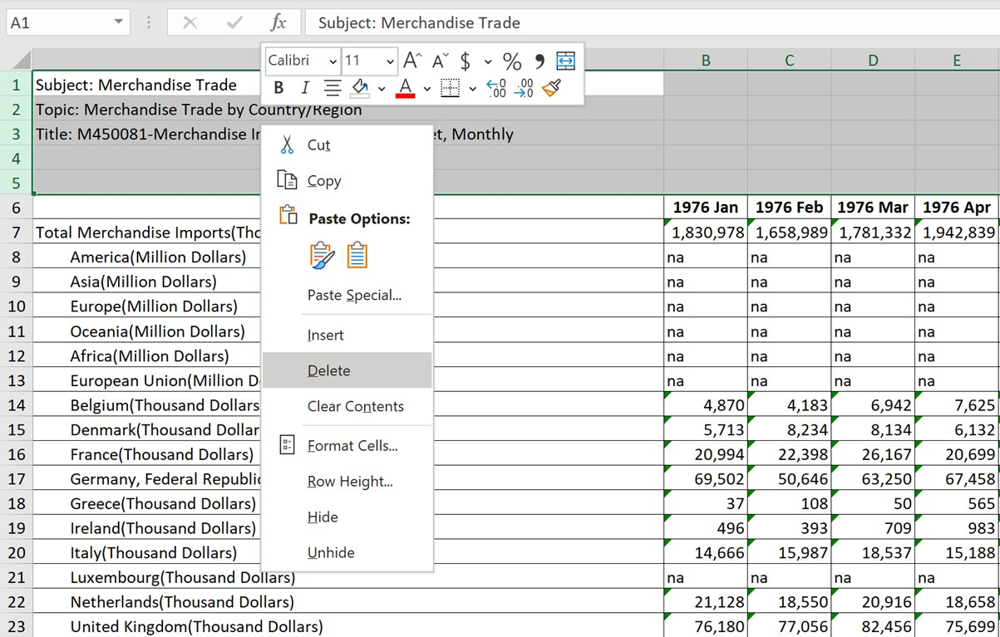{width=50%}
<center>


* **Step 2: Rename undesired data**
Since this DataViz Makeover will only focus on the merchandise trade of the top 6 countries (Mainland China, Malaysia, United States. Taiwan, Japan, and Hong Kong) from the beginning of 2019 to the end of 2020, undesired data should be removed until the sheets look like the image below:
<center>
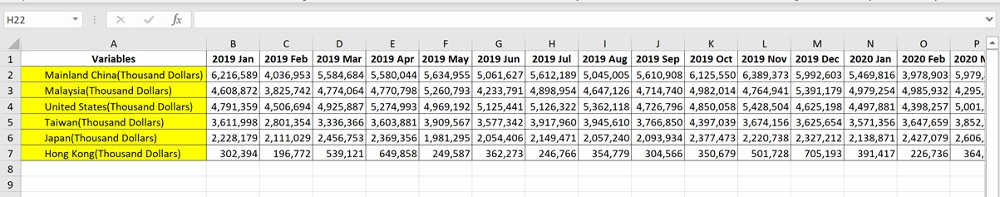{width=70%}


* **Step 3: Reorganizing data**
Tableau recognizes variables by column. Because of this feature, the original data needs to be reorganized. First of all, we need to create a new worksheet named 'Data' in the original excel file.  Add new headers in the Datasheet. There will be in total 4 variables and we should name them “Country”, “Time”, “Imports (K)”, and “Exports (K)”. “K” in the header stands for Thousand Dollars.
Copy data from the original sheets and paste them into Data under corresponding headers. Remember to select the Transpose option while pasting.
In order to let Tableau recognizes the "Time" variable as Date, we need to make sure data under the Time header is in the format of Date.
<center>
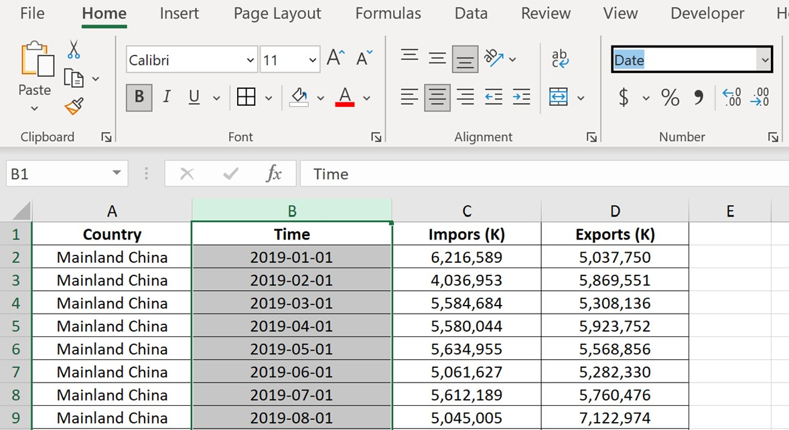{width=50%}
<center>


* **Step 4: Delete undesired sheets**
Delete Content, T1, and T2 from the file. Only the sheet 'Data' should be kept.


## Importing Data into Tableau

* **Step 1: Open Excel file in Tableau**
After open Tableau, select File from panel above to open the file we prepared:


* **Step 2: Change the data type**
Making sure all the variables are in the correct data types.
‘Country’ should be a string format, recognized as Geographic role in Country. ‘Time’ should be recognized as Date. Exports (K) and Imports (K) should in the format of Number (whole).
<center>
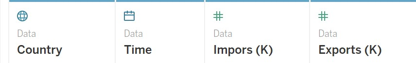{width=50%}
<center>


## Creating Worksheets
There are two main purposes of the original graph, hence two worksheets will be created in this DataViz Makeover to ensure the proposed visualization can have all the functions that the original graph has.

### Worksheet 1: Balance of Trade of the top 6 countries

* **Step 1: Add a new variable**
To draw the first graph, we need to add a new variable in Tableau that represents the Net Exports/ Balance of Trade of 6 selected countries.
Get into the worksheet window, select Analysis > Create Calculated Field. Creating the formula of Net Exports by dragging the existed variables into the newly opened window and name it Net Exports (K): 
<center>
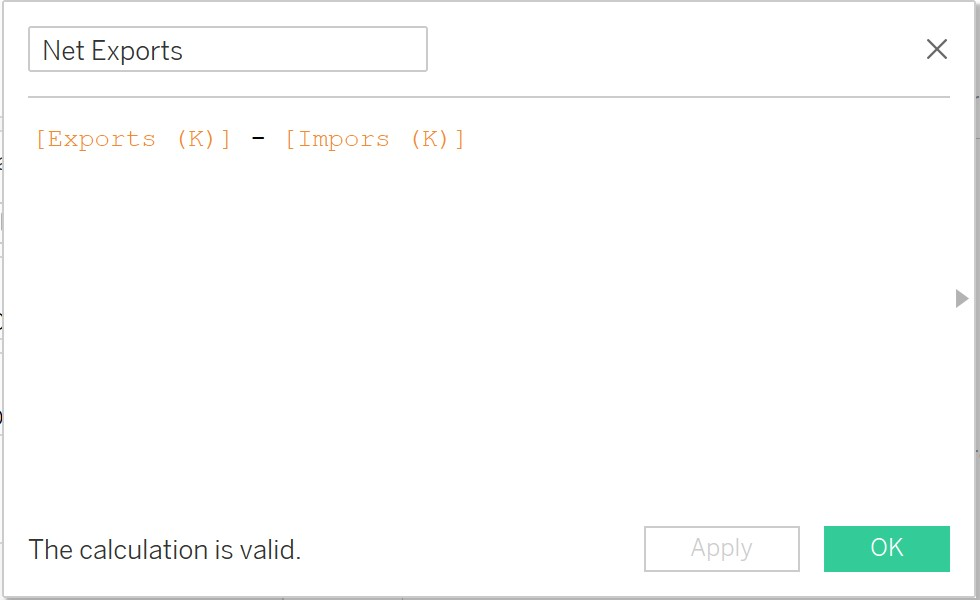{width=50%}
<center>

Then we can find a new variable called 'Net Exports (K)' on the left side panel.


* **Step 2: Set up the graph**
Filling the columns and rows using existed variables as the image below. 
Tableau will automatically draw the graph in a horizontal bar format.
<center>
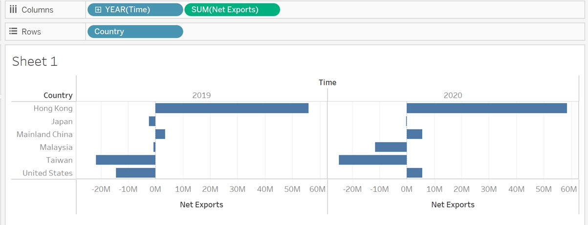{width=70%}


* **Step 3: Improve the design**
The following procedures should be performed to improve the design of the graph:

* Coloring the table based on the sum of the Net Exports of each year.Set the colors into a 2 steps color palette. In this way, the bar will be displayed in red if the Net Exports of a particular country are negative and blue otherwise. The two colors selected by Tableau are quite rich and significantly contrast with each other and the background, therefore we will keep the color choice in this way. The color card is going to be hidden from the graph since they are not necessary for the audience.
<center>
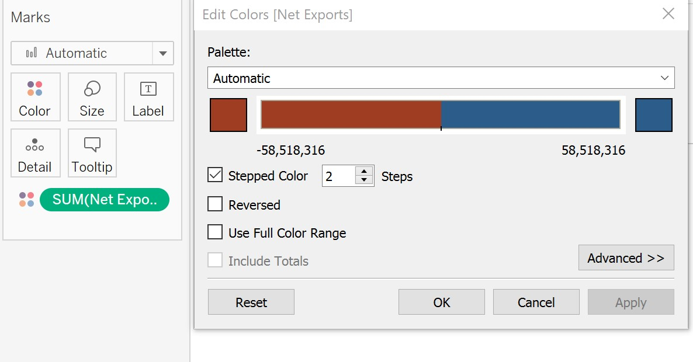{width=70%}


* Adding mark labels by selecting ‘Sum Net Export (K)’ under Label. Set the font size of the label to 8 and make the text bold. Set the labels into a lighter black so that they would not all the attention from the audience. Mark labels will help to identify the represented value of each bar.


* Sort the graph in a descending order based on the sum of Net Exports values in 2020 (since the data in the latest year could be more important for the users). The will make the graph more organized.


* Formatting the tick marks on the x-axis into a darker black. Net export value is a continuous scale. Thick mark help to show the exact point on the axis.

 
* Add title ‘Balance of Trade of Top 6 Countries (2019-2020)’. The font size is set to be 15 and bold.

 
* Add Annotation by right-clicking the bars that worth attention. The font size of the annotation is set to be 10 and bold. If the important change is an improvement, the annotation would be green. If the change is degeneration, the color of the annotation would be red.

The resultant graph is as follows:
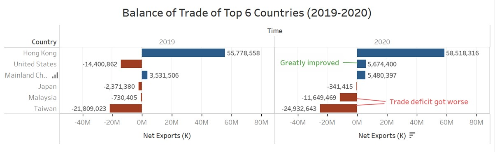

### Worksheet 2: Comparison of the Merchandise Trading Patterns of Top 6 Countries

* **Step 1: Set up the graph**
Filling the columns and rows using existed variables as the image displayed below. Color the graph based on variable Country. Under Show Me, I selected Line (continuous) try. The resultant graph is shown below:
<center>
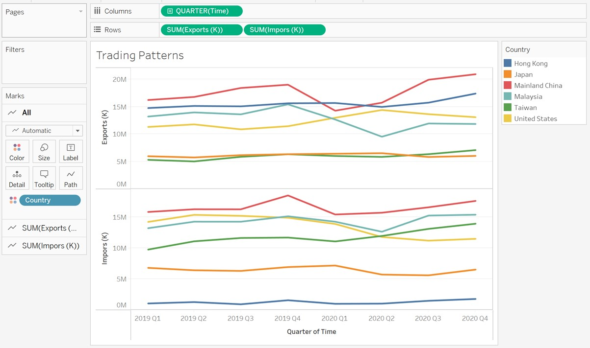{width=70%}

A line graph has drawn here since we want to compare changes over the same period for all 6 countries. Line graph serves better than bar graph here since it can display some small changes within a period of time.
The data covers merchandise trades over 2 years. In order to catch significant small changes and avoid messiness at the same time, the column is filled with Quarters (Time) instead of Years or Months.


* **Step 2: Improve the design**

The following procedures should be performed to improve the design of the graph:

* Ensure the y-axis for both the Exports and Imports sections share the same range so that the y-axis of the whole visualization is consistent. To achieve this, I set a fixed range for both y-axes as follows:
<center>
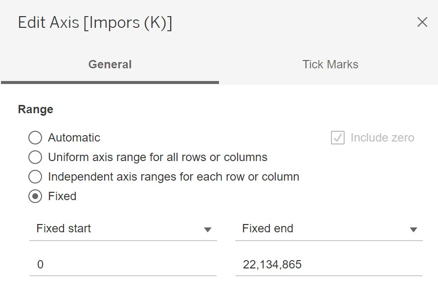{width=50%}


* Reset the color of Malaysia to purple since the turquoise color originally chosen by Tableau does not efficiently contrast to some other colors in the graph (such as green and blue). Colors that strongly contrast with each other would help the users to read and compare the trading patterns of different countries. 
<center>
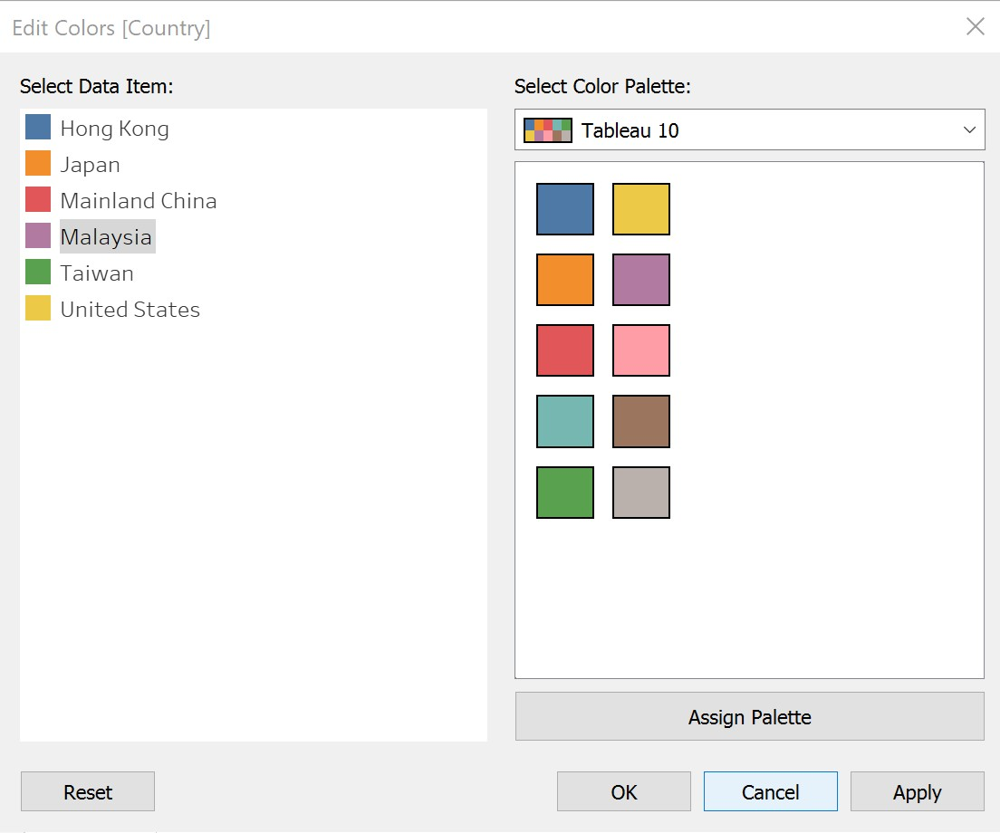{width=50%}


* Adding labels and removing legend from the graph. Select ‘Country’ under Label and set the font size to 8 and bold. Make sure the label matches the mark color so audiences would know which line it indicates. A direct label is more convenient to read compares to legend.
<center>
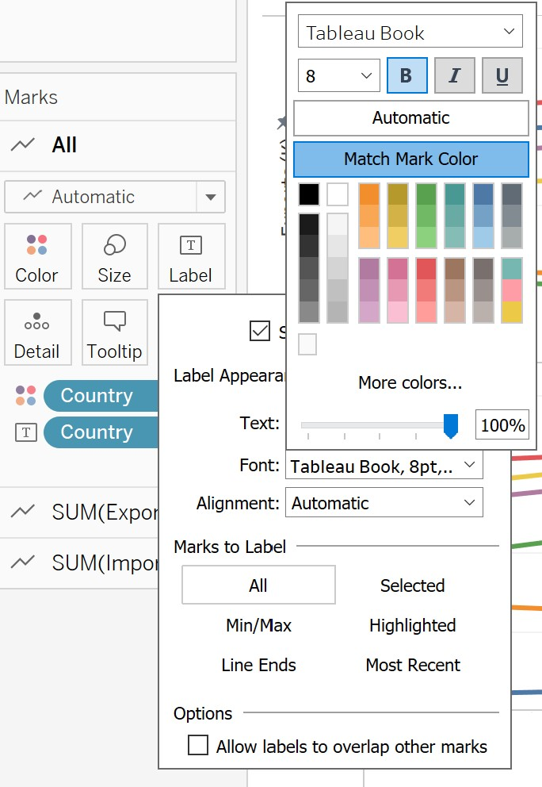{width=50%}

* Formatting the tick marks on the axis into a darker black. Net exports value and Time are both continuous scales. Thick mark necessary for continuous scales.
 
* Add title ‘Merchandise Trading Patterns of Top 6 Countries (2019-2020)’. The font size is set to be 15 and bold.
 
* Add annotation to emphasize the main finding of the graph. The font size of the annotation is set to be 8 and bold.

The resultant graph is as follows:
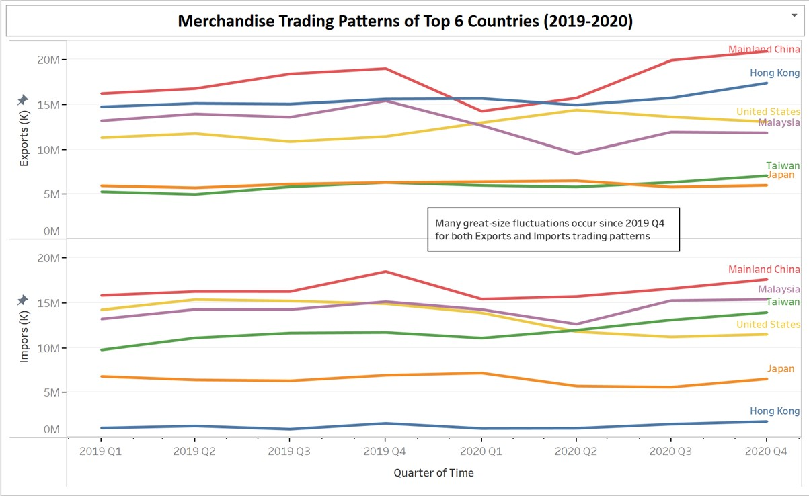
