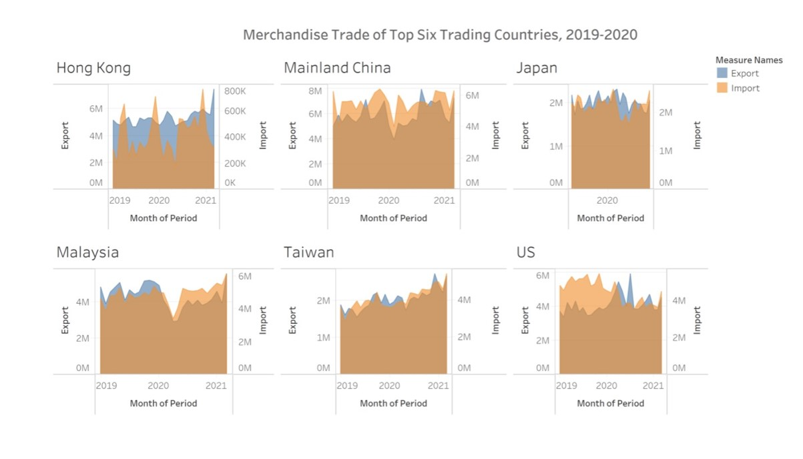
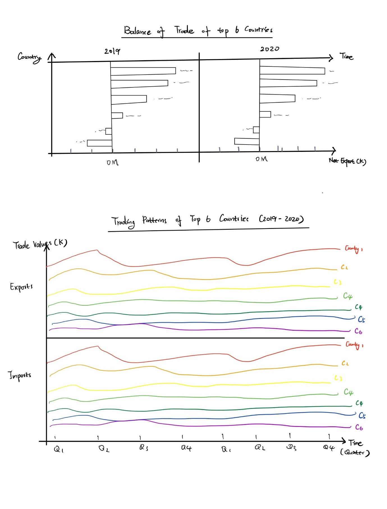

```{r setup, include=FALSE}
knitr::opts_chunk$set(echo = FALSE)
```

# Original Data Visualization

The original data visualization looks like the graph presented below:

The graph presented the merchandise imports and exports of 6 different countries between 2019 to 2020. Six countries included should be the top six trading countries that have the greatest trading values. 

# Part A: Critique of Visualisation

### Clarity

1. **Uninformed Title:** The title of the original graph “Merchandise Trade of Top Six Trading Countries, 2019-2020” does not indicate what the visualization is intended to do. It is quite vague to say what message this graph trying to emphasize. Does it highlight the differences between imports and exports value within 6 countries or does it compare merchandise trading trends of these countries? An unclear title makes it difficult for the audience to catch the key message quickly. 

2. **Inconsistency of period presented:** The x-axis label for Japan is different from the others (2020 only). The graph of Japan contains less information than the others. The difference between the trading history of Japan and that of other countries is unclear because of this limitation.

3. **Inconsistency of y-axes units:** y axes of the graphs of 6 countries have inconsistent labels. For instance, each unit of the Export axis of Hong Kong represents 2M, but each unit of the same axis on the graph of Japan and Taiwan represents 1M only. The same issue can also be found for the Import axes of these graphs. The inconsistency of y-axes would make it difficult to compare the trading history of different countries.

4. **Dual axis is out of sync:** y axes of export and import share different units for the same country. This makes it hard for the audience to compare the imports and exports value of a specific country.

5. **Unnecessary use of Area Chart:** Area chart should be considered only if the total of the value presented is as important as its shares or if there is a large difference between the value presented. However, the original graph does not have any of these purposes. On the other hand, a line graph can display the trading patterns of each country better and a bar chart would be a better choice to be used to emphasize the difference between each country’s imports and exports value. 

6. **No Annotation:** Annotation that helps to tell the data story is not used in the original graph.


### Aesthetic

1. **Invisible Tick Mark:** Tick marks are necessary on a continuous scale. They help to mark the major divisions and show the exact point on the axis. The colour of tick marks on the original is too light and makes them invisible and unhelpful. 

2. **Poor color choice:** Imports and Exports are displayed using two different colours in the original graph. However, both colours are too light hence they do not contrast sufficiently with each other. Using brighter colors will improve the aesthetics of the visualization. 

3. **Separated graphs:** Merchandise trades of these countries are presented in 6 separate graphs. 6 graphs are too much to be showed on one dashboard; this makes the whole visualization ununited and scattered. To improve the aesthetics, data should be presented with a smaller number of separated graphs.

4. **Legend:** A legend is used to indicate different trading types. It could be quite troublesome for audiences to check the legend when they read the graph. A legend should be replaced by a direct label if possible.


# Part B: Alternative Design

The proposed alternative visualization design is displayed below:



## Advantages of the new design: 

### Clarity

1. **Clear titles** are provided to indicate the purpose of the graphs and help audiences to catch the key information quickly.
2. **Consistency of the units and labels** for the x-axis and y-axis. This would make avoid the misleading display of the data provided.
3. Display trading data in a quarter unit would **display smaller changes** that cannot be found in the original graph.
4. **Better graph formats** are adopted to deliver the data in a better and clearer way. 
5. **Annotation** will be added to help to tell the data story.

### Aesthetic

1. **Tick marks** can be seen by the audiences and help them to identify the divisions on the axis.
2. **Legends can be replaced by direct labels**. This makes it easier for the audience to read and also enhance the tidiness of the visualization
3. **Fewer graphs** are presented on one dashboard. Information is united and the display of the dashboard would be more organized.
4. **Contrasting colors** are used to help to deliver the information and improve the aesthetic design of the visualization. 


## Part C: Proposed Visualisation

Please view the interactive visualization on Tableau Public [**here**](https://public.tableau.com/app/profile/manye.liu/viz/DataVisualization_16223090271340/Finallook)

