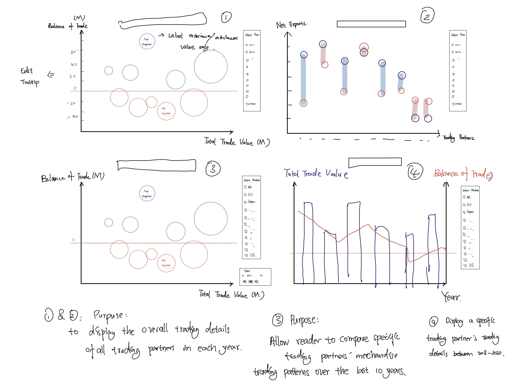
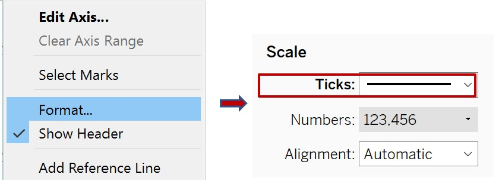

```{r setup, include=FALSE}
knitr::opts_chunk$set(echo = FALSE)
```

## Original Data Visualization

The original data visualization looks like the graph presented below:

The graph presented Singapore’s merchandise trade performance with 10 major trading partners in 2020. It is created by using data provided by the Department of Statistics, Singapore (DOS). The data can be download under the sub-section of Merchandise Trade by Region/Market.


## Part A: Critique of Visualisation

### Clarity

1. **Missing Title:** The title cannot be found in the image provided. This means no insights were highlighted and audiences cannot catch the key information this visualization tries to deliver immediately.  

2. **Axis title:** Titles and labels for both axes fail to indicate the unit of measure for the exports and imports value presented. Since the unit of measure for both axes is unclear, we also have a problem finding out if these axes are synchronized or not.

3. **Unclear message delivery:** The original visualization tries to indicate whether a particular trading partner is a net exporter or a net importer by showing which color region (green or blue) its center point falls. For some trading partners, it is hard to tell which region do they fall in because of the crowdedness and unreasonable graph design. Some circles are too big, and this makes it hard for the audience to see the position of the center points. Circles cover up each other when these trading partners share similar merchandise trading values, and some center points cannot be seen at all. This makes the graph unclear and very difficult to read.

4. **Too much information: ** The original visualization contains too much information at the same time, and this makes it hard to read:
* The size of the circle and information in the tooltips reflect the size of total merchandise trading value instead of the imports and exports value presented on axes. This could be confusing to the audience.
* The background of the original graph separates trading partners into two groups: those that have positive merchandise trading balance with Singapore and those that have negative ones.
* The annotations of star signs with different color backgrounds indicate trading partners that have the greatest net import/export value. These annotations are placed above tooltips that contain total merchandise trading value, which could be misleading.
* No labels or legends are shown in the graph to indicate the information indicated by the color and size of the circles and the background color. Legends of the star signs are placed under the long notes of the graph, and this makes the graph hard to read. Audiences need to read the long notes to understand the complicated design of the original visualization.

5. **One-year trading details only** Only the trading details of 2020 are visualized in the original graph. The variations and changes in the trade performance of these top trading partners cannot be seen.


### Aesthetic

1. **Missing Tick Mark:** Tick marks are necessary on a continuous scale. They help to mark the major divisions and show the exact point on the axis. Tick marks are missing for both axes in the original visualization. 

2. **Poor color choice:** 
* **For the bubbles:** The colors of different circles represent different trading partners. However, some colors in the original graph are do not sufficiently contrast with each other. For instance, the colors of Thailand and the EU are almost the same. Red and Green are used at the same time, which is not friendly to color blinder readers. 
* **For the background:** The light green and blue combination for the background is not a wise choice as light colors with similar tones could be easily ignored by the readers. 
* **Transparency:** Transparency of the circle should be used to avoid occlusion issue.

3. **Messy Tooltip:** Tooltip for all the circles are always showed in the original visualization. In this way, key information and significant findings cannot be highlighted.


## Part B: Alternative Design

The proposed alternative visualization design is displayed below:



### Advantages of the new design

#### Clarity

1. Clear titles are provided to indicate the purpose of the graphs and help audiences to catch the key information quickly.
2. Clear axes title and labels are displayed.
3. Use different colors and sizes to assist readers to compare the differences between different years or different trading partners
4. A reference line is provided to assist the audience to read the visualizations. 
5. There is a Clear theme for each chart, not too much information at once.
6. Edited Tooltips that help to highlight the key message
7. Interactive filters and motion play allow the audience to access more trading information

#### Aesthetic

1. Tick marks can be seen by the audiences and help them to identify the divisions on the axis.
2. Legends are hidden or replace by direct labels to improve the tidiness of the visualization.
3. Transparency is used to avoid occlusion issues.
4. Contrasting colors are used to help to deliver the information and improve the aesthetic design of the visualization. 
5. Only important information will be labeled. This also improves the tidiness of the graphs.


## Part C: Proposed Visualisation

Please view the interactive visualization on Tableau Public [**here**](https://public.tableau.com/app/profile/manye.liu/viz/FinalVisualization_16241799600890/Dashboard)


## Part D: Step-by-step Guide
After downloading data from the Department of Statistics, Singapore (DOS), the instruction below will illustrate how can we prepare the proposed alternative data visualization step-by-step.

### Data Preparation
Unzip the output folder downloaded from the website. Reorganizing the data by using Excel and Tableau for further use. All the steps below should be operated for both T1 and T2 sheets that contain Imports and Exports trading data separately.

* **Step 1:** Delete unnecessary rows and content sheets in the original file for the convenience of future operations. Since this DataViz Makeover will only focus on top trading partners that are included in the original visualization (Mainland China, Malaysia, Indonesia, United States. Taiwan, Japan, Hong Kong, EU, Republic of Korea, and Thailand). The study period is set to be between January 2011 to December 2020. We can high-lighted the data of the desired partners and remove the undesired data. The cleaned data looks like the image below: 

{width=70%}


* **Step 2:** Select all the remaining data in T1 and T2 and paste them in newly created datasheets named ‘Imports’ and ‘Exports’. Select the Transpose option while pasting. In this way, we can have the exports and imports value of each trading partner presented separately.

{width=50%}


* **Step 3:** In the original dataset, European Union has different units (Million Dollars) from the other trading partners (Thousand Dollars). To make it easier for audiences to read the data visualization that will be created, I decided to unify the measuring unit for all trading partners to Million Dollars. To do this, I recalculate the value for every trading partner except the EU by dividing the original value over 1000 and then replace the old imports/exports value with the new ones. 

{width=50%}


* **Step 4:** Save the cleaned excel file and open it in Tableau. Drag ‘Imports’ in the main pane. Select every variable except ‘Variables’, right-click and select Pivot. Two Pivot Field variables that contain trading partners and Import value will be generated.

{width=70%}


* **Step 5:** Right-click the newly created pivot variable that contains trading partner data and select ‘split’. A new variable will be generated which contains the trading partner’s information only. “(Million Dollars)” that shows repeatedly in every cell will be removed. 

{width=70%}


* **Step 6:** Hide the variable that contains both trading partner information and measure unit. Set the three remaining variables into the correct data format. The original “Variables” is renamed as “Time” and set in Date format. The newly split variable is renamed as “Trading Partners” and plays as Country/Region. The last pivot variable is renamed as “Imports” and set into a Number (decimal) data format. Maximize the number of rows presented to ensure all instances in the dataset can be seen in Tableau.

{width=70%}


* **Step 7:** Repeat steps 4 to 6 for the Exports dataset. Copy the values for 4 variables “Time”, “Trading Partners”, “Imports”, and “Exports”. Paste these four variables in a newly created excel sheet called **Final Data**.

{width=70%}


### Creating Worksheets
There are four charts will be created in this DataViz Makeover. Each chart will help the audience to analyze the providing data differently.

#### First Chart:

* **Step 1** Open the Excel file that we previously prepared in Tableau. Drag Final Data into the main pane and make sure every variable is in the right data format. The dataset should look like the image displayed below: 
 
{width=70%}


* **Step 2:** Add two new calculated variables in Tableau that represents Singapore’s Balance of Trade and total merchandise trading value with each trading partner.
Get into the worksheet window, select Analysis > Create Calculated Field. Creating the formula of **Total Trade Value (Million Dollars)** by dragging the existed variables into the newly opened window to form the equation below: 

{width=70%}


Get into the worksheet window, select Analysis > Create Calculated Field. Creating the formula of Balance of Trade (Million Dollars) by dragging the existed variables into the newly opened window to form the equation below: 

{width=70%}


Then we can find a new variable on the left side panel.


* **Step 3:** Create a new worksheet and name it ‘Interactive Bubble Plot’. Drag ‘Total Trade Value’ to Columns and ‘Balance of Trade’ to Rows.

{width=50%}


* **Step 4:** Under ‘Marks’ Pane, select ‘Circle’ from the dropdown list. Drag ‘Trading Partners’ to Detail so that we can have one circle represent each trading partner on the chart. Drag ‘Total Trade Value’ to Size and drag ‘Balance of Trade’ to Color. In this way, we can have the size of each circle representing the total merchandise trading volume of each trading partner and the color of each circle representing its balance of trade with Singapore.

{width=30%}


* **Step 5:** Double-click on the color legends on the right side of the worksheet to edit the color setting. Select Red-Blue-White Diverging from the dropdown list. In this way, circles will be displayed in red if the value of import for a particular trading partner exceeds its exports, and blue otherwise. Tick the box of ‘Use Full-Color Range’ to ensure the color presentation of the chart is rich enough and is significantly in contrast with each other and the background. Click <<Advanced bottom to lock the Center to 0. 
Click on Color under the Marks pane to set the Opacity to 70% to avoid occlusion issues. Set the Border to white color so that the border of each circle is clearer.

{width=70%}


* **Step 6:** Click on Size under Marks pane and adjust the size of circles.

{width=40%}


* **Step 7:** Drag ‘Trading Partners’ and ‘Balance of Trade’ into Label under Marks pane. Click on Label to edit the label set. Change the Alignment to ‘Middle Center’. Change the marks to label from ‘All’ to ‘Min/Max’. Set the Field to ‘Sum(Balance of Trade)’ and tick both boxes before label maximum value and label minimum value.

{width=50%}


* **Step 8:** Right-click on the y-axis to add Reference Line. Set the line at a constant value of 0. Change the format of the reference line into a dotted line and set the color to light red.

{width=50%}


* **Step 9:** Drag ‘Time’ into Filters pane. Select ‘Show Filter’ from the dropdown list so that the filter can be seen on the right side of the worksheet. Change the filter list to a form of ‘Single Value (list)’, click on ‘Edit Title’ and rename the filter to ‘Select Year’. Click on customize and untick the box before ‘Show “All” Value’.

{width=70%}


* **Step 10:** Select Analysis > Create Calculated Field. Creating the formulas of Net Exports (Million Dollars) and Net Imports as the image displayed below:

{width=70%}


* **Step 11:** Drag ‘Net Exports’ and ‘Net Imports’ to Tooltip under Marks pane. Double-click on Tooltip to edit the text of the tooltip as the image displayed below.

{width=70%}


* **Step 12:** Edit Title of this chart by typing “Merchandise Total Trade Value and Trade Balance of Top Trading Partners”. Click ‘Insert’ and choose ‘YEAR(Time)’ from the dropdown list. The font size is set to be 15 and bold.

{width=70%}


* **Step 13:** Formatting the tick marks on the axes into a darker black. Thick mark help to show the exact point on the axis.

{width=50%}


* **Step 14:** Hide the Color and Size legends in the worksheet since they are not very informative for the readers.


#### Second Chart:

* **Step 1:** Duplicate the first worksheet that we have created and name it ‘Motion Graph’.

{width=50%}


* **Step 2:** Remove ‘Time’ from the Filters pane and drag ‘Trading Partners’ into it. Select ‘Show Filter’ from the dropdown list so that the filter can be seen on the right side of the worksheet. Keep the setting of ‘Multiple Values (list)’, click on ‘Edit Title’ and rename the filter to ‘Select Trading Partners’.

{width=70%}


* **Step 3:** Drag ‘Time’ into the Pages pane and we can see the motion play card on the right side of the worksheet. Select Format > Animation, turn on the animation setting, and change the duration of play to 1.00 seconds (Slow).

{width=70%}


* **Step 4:** Edit Title as the image shown below. Click ‘Insert’ and choose ‘Trading Partners’ from the dropdown list. The font size is set to be 15 and bold.

{width=70%}


#### Third Chart:

* **Step 1:** Create a new worksheet and name it ‘interactive bar-line graph’. Drag ‘Year(Time)’ to Columns and ‘Total Trade Value’ and ‘Balance of Trade’ to Rows.

{width=70%}


* **Step 2:** Under Marks pane, select ‘Bar’ from the dropdown list for ‘Total Trade Value’ and select ‘Line’ for ‘Balance of Trade’.

{width=50%}


* **Step 3:** Drag ‘Balance of Trade’ into Color under the Balance of Trade section in the Marks pane. Double-click on the color legends on the right side of the worksheet to edit the color setting. Select Red-Blue-White Diverging from the dropdown list. In this way, circles will be displayed in red if the value of import for a particular trading partner exceeds its exports, and blue otherwise. Tick the box of ‘Use Full Color Range’ to ensure the color presentation of the chart is rich enough to sufficiently contrast with the bar chart of ‘Total Trade Value’. Click <<Advanced bottom to lock the Center to 0. Click ‘Color’ under the Total Trade Value section and set the color of bars to light yellow.

{width=70%}


* **Step 4:** Drag ‘Trading Partners’ into Filters pane. Select ‘Show Filter’ from the dropdown list so that the filter can be seen on the right side of the worksheet. Change the filter list to a form of ‘Single Value (list)’, click on ‘Edit Title’ and rename the filter to ‘Select Trading Partners’.

{width=70%}


* **Step 5:** Right-click on one of the y-axes and select ‘Synchronize Axis’. Choose ‘Format’ to set the color of the dual-axis title into a matching color and set the color of the Tick Marks into a darker one.

{width=30%}


* **Step 6:** Hide legends from Readers since they are not very informative. 


* **Step 7:** Edit Title of this chart ‘Merchandise Trading Patterns of Top 6 Countries (2019-2020)’. The font size is set to be 15 and bold.

{width=50%}


#### Fourth Chart:

* **Step 1:** Create a new worksheet and name it ‘Interactive Balance trade graph’. Drag ‘Trading Partners’ to Columns and ‘Imports’ and ‘Measure Values’ as a dual to Rows. ‘Measure Values’ should include ‘Imports’ and ‘Exports’ only.

{width=70%}


* **Step 2:** Under Marks pane, select ‘Gantt Bar’ from the dropdown list for ‘Imports’ and select ‘Circle’ for ‘Measure Values’.

{width=50%}


* **Step 3:** Drag ‘Balance of Trade’ into Color and Size under the Imports section under Marks pane. Double-click on the color legends on the right side of the worksheet to edit the color setting. Select Red-Blue-White Diverging from the dropdown list. In this way, Gantt bars will be displayed in red if the value of import for a particular trading partner exceeds its exports, and blue otherwise. Tick the box of ‘Use Full Color Range’ to ensure the color presentation of the chart is rich enough. Set Opacity of the color to 40%.

{width=70%}


* **Step 4:** To match the overall color theme of Balance of Trade, I change the color of ‘Exports’ to Blue and the color of ‘Imports’ to Red.

{width=30%}


* **Step 5:** Drag ‘Time’ into Filters pane. Select ‘Show Filter’ from the dropdown list so that the filter can be seen on the right side of the worksheet. Change the filter list to a form of ‘Single Value (list)’, click on ‘Edit Title’ and rename the filter to ‘Select Year’. Click on customize and untick the box before ‘Show “All” Value’.

{width=70%}


* **Step 6:** Right-click on one of the y-axes and select ‘Synchronize Axis’. Choose ‘Format’ to set the color of the Tick Marks into a darker one. Hide the header of the y-axis on the right side and change the title of the other axis into ‘Imports and Exports’.

{width=30%}


* **Step 7:** Hide legends from Readers since they are not very informative. 


* **Step 8:** Edit Title of this chart as the image displayed below. The font size is set to be 15 and bold.

{width=70%}


### Combining worksheets into a Dashboard

Create a new dashboard and drag ‘Interactive Bubble Plot’ and ‘Interactive Balance trade graph’ in. 
Select one of the Time filters and set these two worksheets using this data source by following the instruction shown below:
{width=70%}

Add ‘Motion Graph’ and ‘interactive bar-line graph’ in the same dashboard but different filters are used for these two worksheets.

Final look of the dashboard:


## Part E: Main Observations from New Visualization

* **Hong Kong:** Hong Kong is always the top export partner to Singapore for the past 10 years. The net export value of it is always significantly greater than the other trading partners. In 2020 alone, the net export value of Hong Kong was about 5.67 times the net export value of Indonesia, which is the second top export trader of that year. The merchandise trade value and balance of trade of Hong Kong are relatively stable compare to some other countries. It generally remains a rising trend of merchandise trading with Singapore since 2015 and reaches its own peak in 2018 (Total trading value of 70588 million and Net Exports of 60764 million dollars). However, its trading pattern abnormally decreased for both trading figures from 2018 to 2019. This abnormal fluctuation could be relevant to the social instability caused by massive demonstrations in Hong Kong during that period.

* **Mainland China:** Mainland China replaced Malaysia and became the biggest merchandise trading partner of Singapore in 2013 and maintain the top position until now. This can be explained considering the rapid economic growth of this country in the past 10 years. However, the rising trend of China’s merchandise trading pattern was blocked after a big decline in 2016. Its total trading amount had stopped growing and fluctuated around 136 billion dollars in the past 4 years.

* **Malaysia:** Malaysia had been the biggest merchandise trading partner to Singapore before 2013. After replacing the position by mainland China, Malaysia experienced a declined trend for its total trading volume. Malaysia’s GDP and national revenue were hurt by the collapse in crude prices from 2015 to 2016 and this could be the reason for its declining trading pattern. Although the total merchandise trading rose again in 2017, Malaysia’s net export value kept decreasing since 2014 and it is officially a net importer to Singapore in the past 2 years. This proves that Malaysia has not fully recovered from the decline of its oil exports. 

* **Indonesia:** The total merchandise trading volume of Indonesia significantly dropped in the past 10 years from 81.6 billion to 48.8 billion dollars. The net export value of it also shrinks from 32.4 billion to 10.3 billion. This indicates the economic performance of Indonesia is not very ideal in the past 10 years. Its recent decline of net exports pattern also showed Indonesia hit hardly by the outbreak.


* **The United States:** Before 2018, United States kept being the largest importer to Singapore. However, the exports to the United States kept increasing after 2016. The total merchandise trading volume and net export value of the U.S. both raised significantly in the past four years, and it became one of Singapore’s net exporters in 2020.

* **Taiwan:** Taiwan kept being a net importer to Singapore and the value of its net imports grows significantly after 2016 and it finally became the biggest import trading partner of Singapore in 2018. The size of the total trading volume of Taiwan increased significantly in the studied period.

* **Japan:** Japan continued to be one of the net importers to Singapore. However, the merchandise trade balance of it had increased from -9305 million to -341 million.

* **European Union:** EU is always a net import trading partner. Its imports significantly declined in 2019 but exports increased at the same time. Hence the balance trading value of EU increased rapidly from 2019 to 2020.

* **Republic of Korea:** After 2012, the Republic of Korea has a declining trading trend for its total trade value with Singapore. However, its net export value kept increasing and became a net exporter to Singapore in 2017 and continued to be one in the following 4 years.

* **Thailand:** The merchandise trading of Thailand is the opposite of that of the Republic of Korea. Thailand’s total trading value kept increasing from 46 billion to 75 billion dollars in the past ten years. Meanwhile, the value of its net export kept decreasing.


